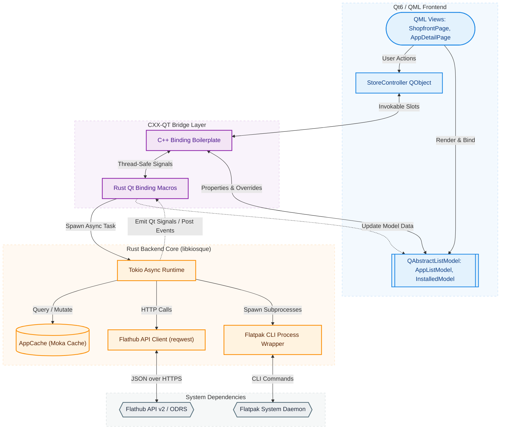

# Kiosque

<p align="center">
  
</p>

A beautiful, fast, and modern Flatpak storefront for the KDE Plasma desktop, inspired by GNOME's software curation aesthetics and built with a hybrid Rust + Qt6/Kirigami architecture.

## The Story & Purpose

The story behind Kiosque began when a GNOME user decided to try KDE Plasma. While the experience behind GNOME Software and *Bazaar* (a fast, Flatpak-centered storefront for GNOME) was highly polished and presented applications beautifully, KDE's default storefront, Discover, felt different. Although Discover is powerful, flexible, and robustly supports both Flatpaks and native packages, the overall storefront presentation can feel cluttered and utilitarian rather than visually engaging.

Kiosque was created to fill this gap: to build a Bazaar-equivalent storefront for the Qt/KDE ecosystem. It is designed to showcase applications in their best light, offering an eye-catching, clean, and intuitive way to discover and manage software for users who prefer a modern GUI over command-line tools.

---

## Detailed Feature Architecture

### 1. Modern Curation UI & Layout
- **Qt6 Quick & Kirigami Integration**: Built upon KDE Frameworks 6 Kirigami, utilizing standard design tokens, page layout models, and theme-adaptive components.
- **Translucent Storefront Styling**: Storefront components (such as *WelcomeCard* and *AppOfTheDayCard*) utilize custom translucency overlays and backdrop styling that align with KDE Human Interface Guidelines.
- **Smooth Animations**: Responsive card layout structures that dynamically transition during state changes, utilizing micro-animations to improve interactive feedback.

### 2. High-Performance Rust Backend (`libkiosque`)
- **Async Runtime**: Standardized on a multi-threaded `tokio` async runtime, offloading all expensive network calls, file system caching, and subprocess operations from the main GUI thread.
- **Type-Safe Serialization**: Utilizes `serde` and `serde_json` to parse high-payload JSON responses from Flathub APIs and local Flatpak CLI utilities into structured Rust representations.
- **D-Bus Integration**: Leverages `zbus` for IPC, monitoring system tray notifications, background process states, and flatpak portal events natively under GNOME and KDE Plasma.

### 3. Flathub API Client & ODRS Integration
- **Connection Pooling**: Uses `reqwest::Client` in a process-wide `OnceLock` singleton. Reuses TCP connections and minimizes TLS handshake overhead with a connection pool size limits (e.g. 4 idle connections per host, 15s request timeout).
- **Open Desktop Ratings Service (ODRS)**: Asynchronously fetches star ratings and user reviews. Merges ODRS data with Flathub app metadata on the Rust side, delivering a unified model to the UI.

### 4. Smart Multi-Layer In-Memory Cache (`cache.rs`)
To minimize redundant network transactions and maintain a highly responsive UI, Kiosque uses a thread-safe, TTL-based caching layer managed by a process-wide `AppCache` singleton utilizing concurrent `moka` caches.
- **Collection Cache (TTL: 5 mins)**: Caches general feeds (popular, trending, recently added/updated).
- **Details Cache (TTL: 10 mins)**: Caches specific app metadata stream payloads to allow instant back-and-forth navigation.
- **ODRS Ratings/Reviews Cache (TTL: 10 mins)**: Caches user review lists and rating distributions.
- **Installed State Cache (TTL: 30 secs)**: Caches the list of locally installed applications. Kept short to quickly reflect user-triggered installation actions.

### 5. Asynchronous Flatpak CLI Execution Wrapper
- **Non-blocking Subprocesses**: Orchestrates local Flatpak state modifications via `tokio::process::Command` without blocking the Qt event loop.
- **Structured Parser**: Invokes `flatpak list --app -j` to acquire local installations in JSON formats, parsing it into structured `FlatpakJsonApp` schemas supporting backward compatibility with varying Flatpak versions.
- **Command Set**: Wraps critical transactional CLI actions: `flatpak install --assumeyes`, `flatpak uninstall`, `flatpak update`, and `flatpak remote-ls`.

### 6. Background Update Daemon (`kiosque-update`)
- **Independent Execution**: A dedicated helper binary that uses the Rust backend to check for updates and schedule downloads.
- **Portal & System Tray Integration**: Supports running as a background service via the `org.freedesktop.portal.Background` portal, offering system tray notifications and scheduled runs.

---

## Technical Architecture & Data Flow

Kiosque uses a hybrid architecture that bridges the performance and safety of Rust with the flexible UI capabilities of Qt6/QML.



### Detailed Architecture Layers

#### 1. Frontend Layer (QML & Kirigami)
The frontend is built using QML and styled with KDE's Kirigami framework. Views like `ShopfrontPage.qml` and `AppDetailPage.qml` are declared in QML. Instead of loading raw files, the QML UI binds to structured models (`AppListModel`, `InstalledModel`) and singular controllers (`StoreController`) defined in Rust and registered as native QML types.

#### 2. The `cxx-qt` Bridge Layer
Rather than writing unsafe manual JNI/C-FFI code, Kiosque integrates Qt6 and Rust using `cxx-qt`.
- **Rust QObject Representation**: Structs like `StoreControllerRust` are annotated with `#[cxx_qt::bridge]` and `#[qobject]`. The macro automatically generates matching C++ classes and handles standard Qt operations.
- **Model Bridging**: Rust models like `AppListModel` inherit from `QAbstractListModel` (annotated with `#[base = QAbstractListModel]`). Overrides for `data()`, `rowCount()`, and `roleNames()` are written in Rust, mapping custom data structures to Qt's index-role system (e.g. `NAME_ROLE`, `ICON_URL_ROLE`, `APP_ID_ROLE`).
- **Thread Safety & Thread Posting**: Since Qt runs on a single main GUI thread and Tokio tasks execute across a background pool, `cxx-qt` provides `cxx_qt::Threading`. Rust tasks capture a thread-safe handle to the QObject, perform async work, and then post closures back to the Qt event loop, allowing property changes and signals to fire safely on the GUI thread.

#### 3. Rust Backend Core (`libkiosque`)
- **Caching Mechanism**: The `AppCache` leverages concurrent, asynchronous caches from the `moka` crate. This enables lock-free read access and concurrent write operations, avoiding the contention of manual locking mechanisms like `RwLock` while still maintaining thread-safe TTL (Time-To-Live) evictions.
- **Network Stack**: Built on async `reqwest`. Features connection reuse to optimize network round-trips to the Flathub API.
- **Process Orchestration**: Local Flatpak commands are run using asynchronous process spawns. Standard output is captured and parsed without blocking other operations.

---

## Detailed Data Flow Example: Searching for an Application

1. **User Action**: The user types a query into the Search field in `ShopfrontPage.qml`.
2. **QML Invocation**: QML invokes `search(query)` on the registered `AppListModel` instance.
3. **Bridge Redirection**: The `cxx-qt` bridge forwards the call to the Rust implementation: `fn search(self: Pin<&mut AppListModel>, query: QString)`.
4. **Model State Transition**:
   - The model sets its `loading` property to `true`.
   - The model clears existing items and resets itself via `beginResetModel` / `endResetModel` posted to the GUI thread.
5. **Background Task Spawning**: Rust gets a thread-safe queue handler (`self.grab_values_from_cxx()`) and spawns an asynchronous task on the Tokio runtime:
   ```rust
   tokio::spawn(async move {
       let client = FlathubClient::new();
       match client.search(&query_string).await {
           Ok(results) => {
               // Map flathub results to AppEntry models
               // Post a closure back to the Qt event loop to update model items and set loading = false
           }
           Err(err) => {
               // Post error signals back to the GUI thread
           }
       }
   });
   ```
6. **Network Request**: The search request runs via `reqwest` to `https://flathub.org/api/v2/search`.
7. **GUI Update**: The Tokio thread receives the search response, parses it, and uses the bridge context to run `beginResetModel()`, populate the Rust vector list of `AppEntry` models, call `endResetModel()`, and set `loading` to `false` on the GUI thread. The QML list view automatically animates and displays the new search results.

---

## Requirements & Setup

To build and run Kiosque from source, ensure you have the following dependencies:

- **Compiler**: GCC/Clang with C++17 support, and the Rust toolchain (`cargo` and `rustc` version 1.75+)
- **Build System**: Meson (version 0.60+) and Ninja
- **System Libraries**:
  - Qt6 (Core, Gui, Qml, Quick, QuickControls2, DBus, Widgets)
  - KF6 Kirigami (KDE Frameworks 6 UI component system)
  - KF6 I18n & I18nQml (KDE Frameworks 6 translation support)
  - `dbus-1` (D-Bus message bus system library)

---

## Building & Installation

Kiosque uses Meson to build the project. The build configuration automatically spawns Cargo to compile the Rust backend library (`libkiosque.a`) and links it directly into the C++ frontend binaries.

```bash
# Clone the repository
git clone https://github.com/niltonperimneto/Kiosque.git
cd Kiosque

# Configure the build directory
meson setup build

# Compile all targets (executable and update daemon)
meson compile -C build
```

Once built, you can launch Kiosque or the background update utility:
```bash
# Launch the graphical storefront
./build/kiosque

# Launch the background update utility
./build/kiosque-update
```

---

## License

This project is licensed under the terms of the **GNU General Public License version 3, or (at your option) any later version** (GPL-3.0-or-later).

For the complete license text, please refer to the [LICENSE](file:///home/niltonperimneto/Kiosque/LICENSE) file in the root of this repository.
